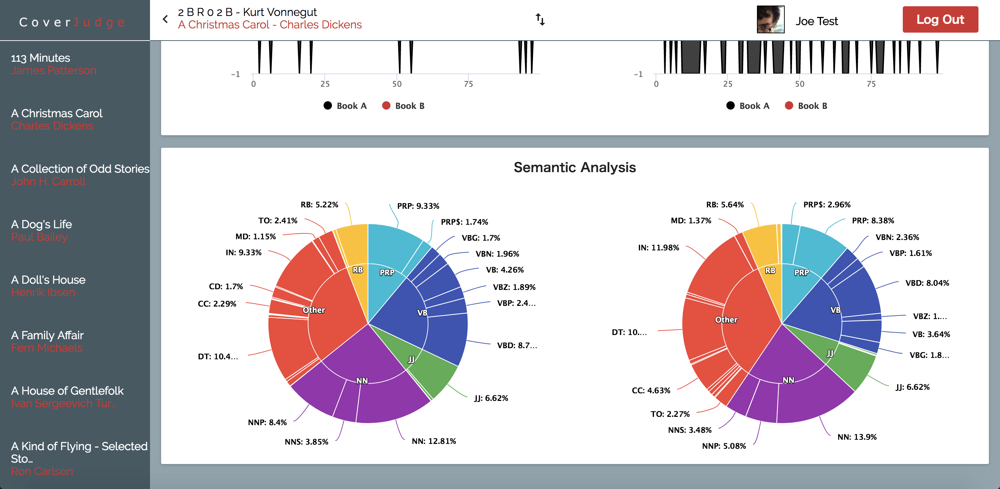

Occas.io
========

Website for domain experts

## Screens




## Technology

React, Nodejs, MongoDB

## Installation

Create a .env with the following variables defined:

NODE_ENV,DOM_USR,DOM_PASS,MONGODB,DOM_INDEX,ESTIBOT_USR,ESTIBOT_PASS

Then start the server like so:

```
  npm start
```

This should kick off the installation process right away, but if there is a problem, you can use the following command to install again:

```
  npm install
```

## Building

```
  npm run build
```

## Partner Repos

This repo is a direct partner with the flask-epp for dedicated server requests from a specified IP address. Without it, this website would be unable to buy/sell domains.

## License

The code in this repo is licensed under the Apache 2.0 License.
See [LICENSE.txt](LICENSE.txt) for more info.